# Full Stack Tutorial with Ember (JavaScript) and Django (Python)
In 2019, many developers find themselves building applications using frontend JavaScript frameworks that query data from an API. One of those frontend frameworks is Ember.js, which comes batteries-included with routing, models, testing and an ecosystem of plugins and helpers. Django, a high-level MVC Python web framework, with the powerful toolkit Django Rest Framework (DRF), is a useful tool for powering API development.

Michael Johnson will speak about Full Stack Web Development with Ember.js and Django in Python. This talk will cover high-level concepts about APIs, as well as low-level demonstration of code required to connect frontend to the backend. The final product will make client-side (browser) changes that will persist in a database through the API.

### About the Author
Michael Johnson is a software developer who transitioned from a career in science and engineering. Michael enjoys fun and games, but gets the biggest thrill in life from collaborative learning and teaching. He is an advocate for minorities in STEM and loves to dance. Originally from just outside of Seattle, Mike moved to Iowa for graduate school where he did research on photonic sensors, after studying bacteria as an undergrad. He taught physics at Grand View University before transitioning to web development. The tech stack for this presentation is inspired by the development process he learned while working at IMT Group’s Computer Service Dev Team. While enjoying the tech and team at IMT, he has chosen to pursue other adventures with Source Allies.

## Resources
### Python/Envs:
[Using Pyenv + Pipenv](https://hackernoon.com/reaching-python-development-nirvana-bb5692adf30c).

### Django:
[Django Tutorial](https://docs.djangoproject.com/en/2.2/intro/tutorial01/) << official tutorial straight from the choice

[Excellent Tutorial to Understand Django Rest Framework](https://www.django-rest-framework.org/tutorial/1-serialization/) << starts by showing nuts and bolts then helps you abstract away lines of code in views and serializers via DRF helpers 

### Django + Ember:
[5-part Tutorial on getting Ember and Django Working Togehter 👌](https://medium.com/@sunskyearthwind/django-emberjs-full-stack-basics-connecting-frontend-and-backend-part-1-beed8c386b08) << great tutorial to replicate the process from in this talk

### Ember:
[Ember Tutorial Straight from the Source](https://guides.emberjs.com/release/tutorial/ember-cli/) << includes the latest < AngleBracket /> component invocation

[Excellent Intermediate Ember Tutorial](https://yoember.com/#lesson-1) << build a full CRUD app using Firebase ❤️

[Django Cors Headers](https://github.com/ottoyiu/django-cors-headers) << Cross origin solution for django

### Ember Helpers:
[Ember Bootstrap Addon](https://www.ember-bootstrap.com/) and [Bootstrap](https://getbootstrap.com/) << Gotta love a good CSS framework

[Ember Moment Addon](https://github.com/stefanpenner/ember-moment) and [Moment.js] << time sucks

### Related by Mike:
[My Pyowa Tutorial/Demo on Django + Django Rest Framework in Depth](https://github.com/micleners/pyowa-drf-demo) << if you want to know more about serialization and view helpers in DRF

# Backend API with Django

## Setup
### Prereq: Setup Virtual Environment
You can setup the virtual environment for this project however you'd like, but for this demonstration we will be using Pyenv + Pipenv - as can be learned about in [this tutorial](https://hackernoon.com/reaching-python-development-nirvana-bb5692adf30c).

Make a directory for your backend API and navigate into it by entering in the command line:

`mkdir events-backend`

`cd events-backend`

Create your virtual environment and install django, DRF, and DRF-JSONAPI. We can do this by entering in the command line (note: if you are using a regular virtual environment and not pipenv, replace `pipenv` with `pip` or `conda` depending on your package installer of choice):

`pipenv install django`

`pipenv install djangorestframework`

`pipenv install djangorestframework-jsonapi`

Sweet - now let's activate our virtual env:

`pipenv shell`

**Note**: If you ever get stuck with pipenv activated in a weird state (happened to me when getting started with pipenv), you can always exit the shell with `exit` and try to activate it again.

## Start Start Your Django Project
Create a new django project by entering in the command line:

`django-admin startproject main_project .` << the dot allows the project to be created in the directory the command was called from, rather than creating a new directory for the project.

At this point, we can spin up the backend, but there's not much fun to do. Let's first apply migrations with the command:

`python manage.py migrate`

You'll see a bunch of auth tables were created for the backed in `users` and `groups` functionality in django. Sweet! Let's create a superuser:

`python manage.py createsuperuser`

The only two required fields are `username` (or leave blank to use defualt) and `password`. Now let's spin up our backend server and check out the Django Admin interface:

`python manage.py runserver`

#### Optional Side Quest: Investigating Django Admin
Navigate to the base URL to see the cuteness that Django provides you with: http://localhost:8000 - that's cure right? However, let's check out the baked in Django Admin: http://localhost:8000/admin. Login with the credentials you created for your superuser.

Click on the `Users` entry in the table and let's create some users.

- Click `Add User +` at the top right
- Enter a username and password
- Click save
- Scroll through "Change User" and click save again

Great - this was a little side detour to show you what django's admin is like. You can imagine if you have different models like "Blogs", "Sites", "Books" or whatever your project is about - you could manage those entries here.

Let's go ahead and create our Events App and set up our API endpoints!

## Create the Events App and Update Settings
The main project is the hub where you can connect "apps". The paradigm of Django is to make "apps" modular and plug & play in other projects. We won't be using Django this way but it is possible. 

Let's create our events app by entering in the command line:

`python manage.py startapp events`

Now we need to add the app `events` into our `main_project`. Navigate to the file: `main_project/settings.py` and update it to the following:

```python
INSTALLED_APPS = [
    'django.contrib.admin',
    'django.contrib.auth',
    'django.contrib.contenttypes',
    'django.contrib.sessions',
    'django.contrib.messages',
    'django.contrib.staticfiles',
    # import rest_framework for viewset and serializer helpers
    'rest_framework',
    # add `events` application to main project
    'events'
]
```

## Creating API for Users in Events App

Since Django comes with a users model already baked in, we can quickly use DRF to serailize and present endpoints with this user data. We will need to:

1. Create a serializer
2. Create a view
3. Register our API as a URL

### 1 - Create a serializer
In our events app we will need to create a new file: `events-backend/events/serializers.py`. In this file we will add the following:

```python
from django.contrib.auth.models import User
from rest_framework import serializers


class UserSerializer(serializers.HyperlinkedModelSerializer):
    class Meta:
        model = User
        fields = ('url', 'username', 'email', 'groups')
```

Note that we are importing the model from a django package because the User model comes built in with Django. Sweet! We also import serializers from Djagno Rest Framework. You can imagine the serialize is a machine that takes in a Django model and converts it to API readable JSON (and vice versa). See the figure below for a visual representation of the process:

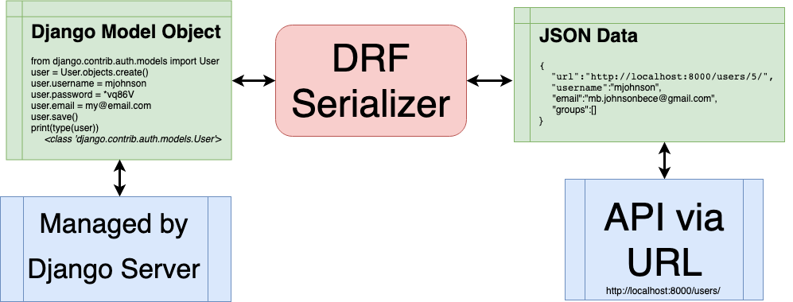

### 2 - Create a view
Navigate into the already generate file: `events-backend/events/views.py` and add a view for our events:

```python
from django.contrib.auth.models import User
from rest_framework import viewsets
from .serializers import UserSerializer


class UserViewSet(viewsets.ModelViewSet):
    """
    API endpoint that allows users to be viewed or edited.
    """
    queryset = User.objects.all().order_by('-date_joined')
    serializer_class = UserSerializer
```

This allows us to use our serializer connected to a URL (to be created in the next section). While the code here is really simple, what is imported from Django Rest Framework and used as `viewsets.ModelViewSet` is really powerful. This creates all the CRUD functionality we need for our API (GET, POST, PUT, PATCH and DELETE) for not only a list of all our model objects, but for a single model object.

### 3 - Connect our view to a URL
Navigate to the main project's URL file: `events-backend/main_project/urls.py` and change it to the following:

```python
from django.contrib import admin
from django.urls import include, path
from rest_framework import routers
from events import views

router = routers.DefaultRouter()
router.register(r'users', views.UserViewSet)

# Wire up our API using automatic URL routing.
# Additionally, we include login URLs for the browsable API.
urlpatterns = [
    path('api/', include(router.urls)),
    path('api-auth/', include('rest_framework.urls', namespace='rest_framework')),
    path('admin/', admin.site.urls),
]
```

Now everything should be routed up for us to run our backend and access our API. Run the command:

`python manage.py runserver`

and navigate to: http://localhost:8000/api/

Here you can see the one model we've loaded so far, users, click it to see our data at the url: http://localhost:8000/api/users/

Notethat you can also click on an individual user and see a detail view (same as our list view in this simple example). You can also use this interface to post, put, and delete:

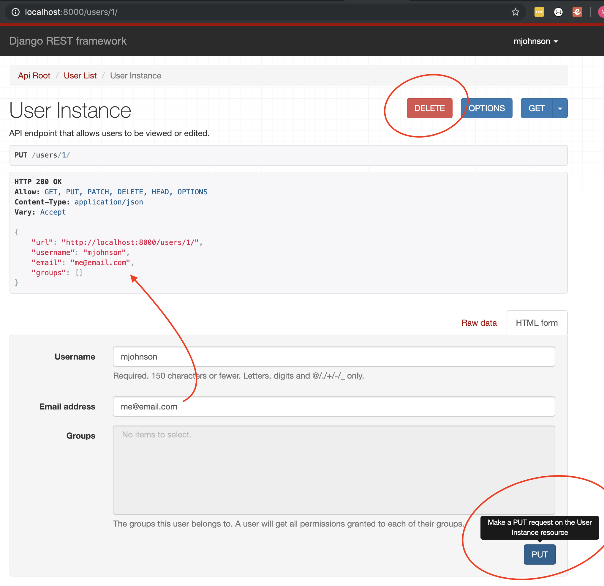

## Building Model, Serializer, View and URL for Events
Building an API endpoint for the built in User model was just an apetizer. Let's build out a model connected to a URL via DRF serializer and view for our events model. We will need to do the following:

1. Create our new model (and make migrations)
2. Create a serializer for events

Then to demonstrate the power and flexibility of DRF, two ways will be used to demonstrate the following:
3. Create views for our events
4. Route up our URLs to our views


### 1 - Creating our Events Model
Navigate to the file in our events app: `/events-backend/event/models.py` and creat your model with appropriate fields:

```python
from django.db import models
from django.utils import timezone

# basic information for our events 
class Event(models.Model):
    # Only required field is title
    title = models.CharField(max_length=256)
    presenter = models.CharField(max_length=256, blank=True)
    # Default time is now if not provided
    time = models.DateTimeField(default=timezone.now)
    location = models.CharField(max_length=256, blank=True)
    description = models.TextField(blank=True)
```

Note that Django provides us with different field types like CharField, DateTimeField and TextField. You can find out more information about [django models] and [django model fields] from the Django documentation.

To update our database to be in sync with the models in our code, we need to run two commands:

`python manage.py makemigrations`

`python manage.py migrate`

You should see that tables are created for our new django models. Great. Now let's make a serializer.

### 2 - Making a serializer for Events
Navigate to the `serializers.py` file in events and create a serializer similar to how we did for users. 

```python
from django.contrib.auth.models import User, Group
from .models import Event
from rest_framework import serializers


# serializers to convert from Django model objects to JSON
class UserSerializer(serializers.HyperlinkedModelSerializer):
    class Meta:
        model = User
        fields = ('url', 'username', 'email', 'groups')

# or specify all fields
class EventSerializer(serializers.HyperlinkedModelSerializer):
    class Meta:
        model = Event
        fields = '__all__'
```

Note that this time we need to import our model from the events app we are within, and that we can use the '__all__' helper instead of writing out each field individually.

## Method 1: ModelViewSet and URL register
We'll start by showing how to build up our API with just a simple ModelViewSet view, like we did for our users. Then we'll demonstrate how to build out our views for `list` and `detail` individually using generics and mixins.

### 3 - Creating a View for our Events
Navigate to the `views.py` file in our events app. We will use the same approach as with our user viewset:

```python
from django.contrib.auth.models import User
from rest_framework import viewsets
from .models import Event
from .serializers import UserSerializer, EventSerializer


class UserViewSet(viewsets.ModelViewSet):
    """
    API endpoint that allows users to be viewed or edited.
    """
    queryset = User.objects.all().order_by('-date_joined')
    serializer_class = UserSerializer

class EventViewSet(viewsets.ModelViewSet):
    """
    API endpoint that allows groups to be viewed or edited.
    """
    resource_name = 'events'
    queryset = Event.objects.all()
    serializer_class = EventSerializer
```

Notice that we imported our events model from models.py and our serializer as well. We also had to create a `resource_name` for this viewset, in order to make this API resource compatible with Ember, which is in compliance with JSON-API Standard (discussed later)


### 4 - Connecting our URLs
Go back to `events-backend/main_project/urls.py` and register the EventViewSet similar to how we registered the UserViewSet

```python
from django.urls import include, path
from django.contrib import admin
from rest_framework import routers
from events import views

router = routers.DefaultRouter()
router.register(r'users', views.UserViewSet)
router.register(r'events', views.EventViewSet)

urlpatterns = [
    path('api/', include(router.urls)),
    path('api-auth/', include('rest_framework.urls', namespace='rest_framework')),
    path('admin/', admin.site.urls),
]
```

Now we can start our server again:

`python manage.py runserver`

And navigate to our Events API: http://localhost:8000/api/events/

But oh no 🙊We don't have any data! Lucking the DRF API interface allows us the ability to POST in the browser interface. Create a few model instances and explore this interface before moving on:

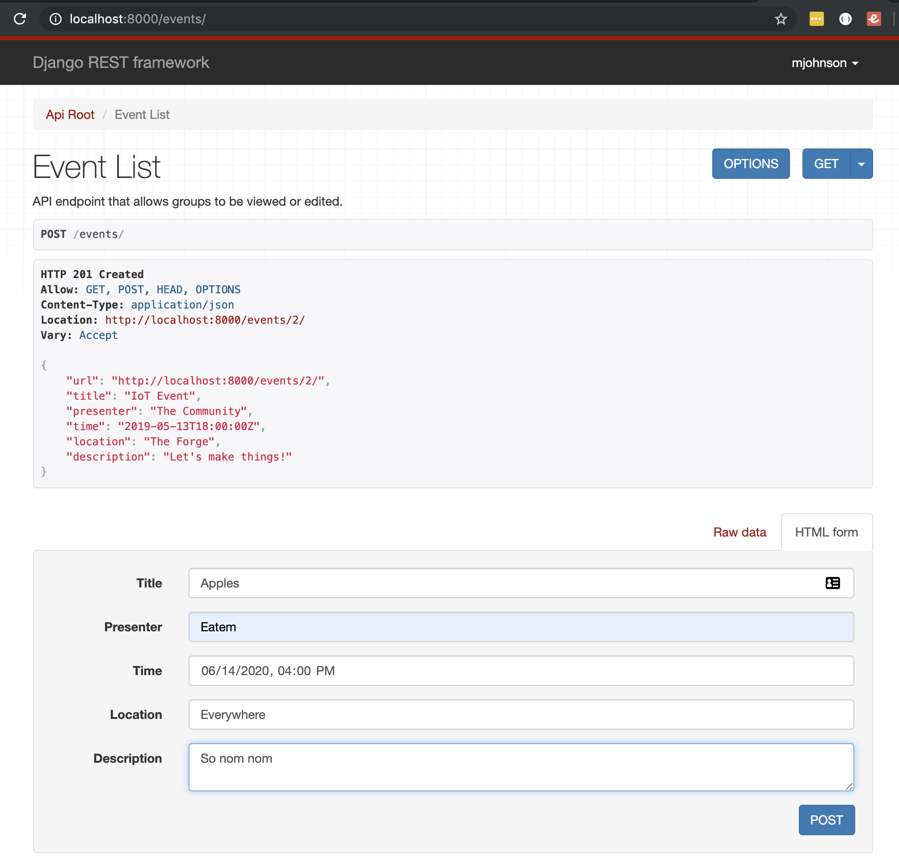

## Method 2: Using DRF Generics + Mixins
The creation of our views in django was really simple using the `ModelViewSet` DRF helper to build both our `api/events/` and `api/events/{id}` CRUD endpoints. 

If you're curious how you might take more control from DRF, this section will you show you how to:

1. Build an EventList API endpoint for create and listview
2. Build a single Event API endpoint for Read, Update, and Delete
3. Build those views in the `events/urls.py` << note: thus far we've only used `main_project/urls.py`
4. Load the `events` urls into `main_project` urls in a different API namespace: `api_verbose`

### 1/2 - Event List View
Navigate to `events/views.py` and add the views for `EventListView` and `EventDetailView`. These new sections are designated with `# 2.` in the code below in addition to `# 1` that should already be there.

```python
from django.contrib.auth.models import User
from rest_framework import viewsets, generics, mixins
from .models import Event
from .serializers import UserSerializer, EventSerializer


class UserViewSet(viewsets.ModelViewSet):
    """
    API endpoint that allows users to be viewed or edited.
    """
    queryset = User.objects.all().order_by('-date_joined')
    serializer_class = UserSerializer

# Two options for building up Event serializer - simpler or more complex
# Both option yield same result - could there be any benefits for using the second option?
# 1. ModelViewSet contians all the functionality present in two Views below
class EventViewSet(viewsets.ModelViewSet):
    """
    API endpoint that allows groups to be viewed or edited.
    """
    resource_name = 'events'
    queryset = Event.objects.all()
    serializer_class = EventSerializer

# 2. EventListView with create mixin and listview for frontend localhost:4200/events/ url
class EventListView(mixins.CreateModelMixin, generics.ListAPIView):
  resource_name = 'events'
  serializer_class = EventSerializer
  def get_queryset(self):
    return Event.objects.all()
  def post(self, request, *args, **kwargs):
    return self.create(request, *args, **kwargs)

# 2(continued). Retrieve/Update/Delete view for frontend localhost:4200/events/[id] url
class EventDetailView(generics.RetrieveUpdateDestroyAPIView):
  resource_name       = 'events'
  lookup_field        = 'id'
  serializer_class    = EventSerializer

  def get_queryset(self):
    return Event.objects.all()
```

Note that we imported two new namespaces from `rest_framework`. The first, `generics`, as described from django documentation:
>Django’s generic views... were developed as a shortcut for common usage patterns... They take certain common idioms and patterns found in view development and abstract them so that you can quickly write common views of data without having to repeat yourself.

You can [read more about DRF generics](https://www.django-rest-framework.org/api-guide/generic-views/) on their website. This link also explains:
>If the generic views don't suit the needs of your API, you can drop down to using the regular APIView class, or reuse the mixins and base classes used by the generic views to compose your own set of reusable generic views.

Thus why we used mixins to augment our views. A ListView is not enough for our purposes, so we added a `CreateModelMixin`. You can [read more about mixins](https://www.django-rest-framework.org/api-guide/generic-views/#mixins) on the DRF website.

### 3 - Build URLs in Events App
We will need to create a file for this task: `events-backend/events/urls.py`. In this we will register both ListView and DetailView endpoints at their respective URLs:

```python
from .views import EventAPIView, EventRudView
from django.urls import path

app_name = "api_verbose"

# two URL paths that will be located on localhost:8000/api_verbose for method #2
urlpatterns = [
  path('events/', EventAPIView.as_view(), name='event-create'),
  path('events/<int:id>/', EventRudView.as_view(), name='event-detail')
]
```

The fist endpoint takes no parameters. However the second takes in an `id` parameter. This is what provides the `id` in the `lookup_field` of the `EventDetailView`.

### 4 - Load Event URLs into Project URLs
Since we registered our two URLs in the events project, we need to `include` these URLs upon a certain namespace within `events-backend/main_project/urls.py`:

```python
from django.urls import include, path
from django.contrib import admin
from rest_framework import routers
from events import views

# Two options for building out API endpoints
# 1. Loading in ViewSets using "default router"
router = routers.DefaultRouter()
router.register(r'users', views.UserViewSet)
router.register(r'events', views.EventViewSet)

urlpatterns = [
    path('api-auth/', include('rest_framework.urls', namespace='rest_framework')),
    path('admin/', admin.site.urls),
    # 1(continued). Including this "default router" at the base of the API: localhost:4200
    path('api/', include(router.urls)),
    # 2. Including URLconf imported from `api` application, on api base url: localhost:4200/api
    path('api_verbose/', include('events.urls', namespace='api_verbose')),
]
```

Now we should be able to access both API endpoints and confirm that functionally they provide the same data/capabilities:
- http://localhost:8000/api_verbose/events/ & http://localhost:8000/api/events/ provide the same functionality and view
- http://localhost:8000/api_verbose/events/1 & http://localhost:8000/api/events/1 provide the same functionality and view

Sweet, so what was the point of all this? I'll leave this as a take home for you to think about: what could be the benefit of choosing `Method 1` or `Method 2` from above? Which is simpler? Which offers more customization/control?

## Return to Main Path: Our Flat JSON vs JSON-API Spec
It's been mentioned that Ember uses JSON-API. We also installed Djagno Rest Framework JSON-API. However, our data currently is showing in our API as JSON. Let's take a brief second to discuss the difference.

JSON (JavaScript Object Notation) is a lightweight for of data that is easy to read and write as humans. It has become widely accepted as a way to transfer data over the internet. It is based off the way we create objects in JavaScript with key/value pairs. The keys are string and the values can be strings, numbers, arrays, or even objects themselves.

```javascript
{
    "key1": "value1",
    "key2": "value2",
    "id": 32,
    "key_awesomeness": "my awesome value"
    "properties": ["list", "of", "values"]
    "related models": {
        "apples": "nom nom",
        "events": "tonight",
        "users": ["Tommy", "Rakesh", "Aardvark"]
    }
}
```

The flexibility of JSON is awesome as it allows you to structure data how you'd like. However, this flexibility also creates issues. I ask an API for data and receive a JSON, I may have no clue how it might be coming accross. 

This is where JSON-API Specification helps. It is a standardized approach to how JSON will be structured so the consumer always knows what to expect. As they say on [their website](https://jsonapi.org), 

> By following shared conventions, you can increase productivity, take advantage of generalized tooling, and focus on what matters: your application.

Not only does it help in teams to have an agreed convention, but Ember data expects JSON-API. So if we format our data fron Django according to this format, Ember can easily translate the data into Ember models with easy - no munging necessary! How cool is that?

### Our Data on JSON-API
The diference between JSON and JSON-API for our events model is shown below.

While you don't see too drastic of a difference, JSON-API is especially important when models have related values and when we want (or don't want to) to retreive the related data when calling our endpoints. Unfortunately, demonstrating this is outside the scope of this tutorial.

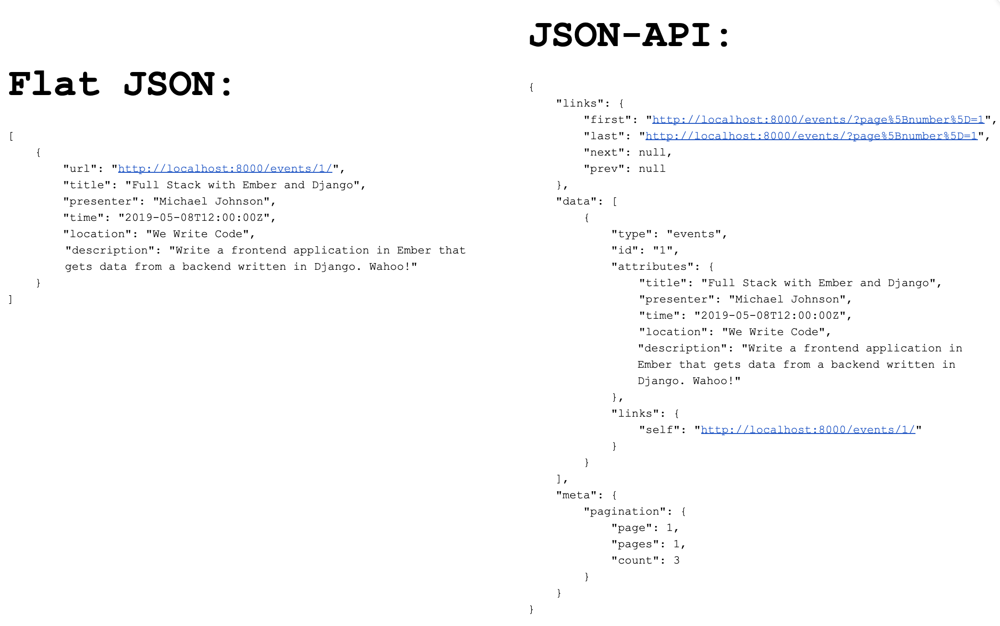

While JSON-API is more verbose, the consisten structure and the information provided is much more useful for microservice communication.

### Activate JSON-API in our Django App

We have already installed DRF JSON-API at the start of the tutorial. All we need to do now is paste in the following code that will set up our JSON-API for easy communication with Ember in `main_project/settings.py`:

```python
# RestFramework settings for DjangoRestFramework-JSONAPI
REST_FRAMEWORK = {
  'PAGE_SIZE': 100,

  'EXCEPTION_HANDLER':
    'rest_framework_json_api.exceptions.exception_handler',

  'DEFAULT_PAGINATION_CLASS':    'rest_framework_json_api.pagination.JsonApiPageNumberPagination',
  'DEFAULT_PARSER_CLASSES': (
    'rest_framework_json_api.parsers.JSONParser',
    'rest_framework.parsers.FormParser',
    'rest_framework.parsers.MultiPartParser'
  ),
  'DEFAULT_RENDERER_CLASSES': (
    'rest_framework_json_api.renderers.JSONRenderer',
    'rest_framework.renderers.BrowsableAPIRenderer',
   ),
   'DEFAULT_METADATA_CLASS': 'rest_framework_json_api.metadata.JSONAPIMetadata',
   'DEFAULT_FILTER_BACKENDS': (
     'rest_framework.filters.OrderingFilter',
    ),
   'ORDERING_PARAM': 'sort',

   'TEST_REQUEST_RENDERER_CLASSES': (
     'rest_framework_json_api.renderers.JSONRenderer',
    ),

   'TEST_REQUEST_DEFAULT_FORMAT': 'vnd.api+json'
}
```

You can refresh the API in your browser and see the data format has changed: http://localhost:8000/api/events

# Frontend Application with Ember

## Setup
### Prereq: Node/NPM
Check by running the the command line:

`node --version`

`npm --version`

If you get `command not found` error, install Node:
- Windows or Mac users can download and run this [Node.js installer](http://nodejs.org/download/).
- Mac users often prefer to install Node using [Homebrew](http://brew.sh/). After installing Homebrew, run `brew install node` to install Node.js.
- Linux users can use [this guide](https://blog.teamtreehouse.com/install-node-js-npm-linux) or [this guide](http://www.callstack.in/tech/blog/4-ways-to-install-node-js-on-ubuntu-83) for Node.js installation on Linux.

### Install Ember CLI
Install Ember using npm:

`npm install -g ember-cli`

Verify that installation was successful:

`ember -v`

### Start Ember project
In base directory of your project (where your django project is located), run the following command to start your ember project:

`ember new events-frontend`

Note that the last parameter `events-frontend` will be the project name.

Move into the frontend directory:

`cd events-frontend`

Note that a git repo has already be setup in this folder. This will cause issues for you if you created a git repo in the base directory of your project.

## Installing Ember Addons
The ember community has developed a vast ecosystem of addons to make developing in ember easier and simpler. The two we will be using are well known projects that have been ported to be installed directed into Ember as addons.
### Bootstrap
I can't stand an unstyled application and I have experience with Bootstrap, so this will be the frontend library used for styling in this application. More info about [Ember Bootstrap Addon](https://www.ember-bootstrap.com/) and about [Bootstrap](https://getbootstrap.com/).

Install Ember Bootstrap by running on the command line:

`ember install ember-bootstrap`
### Moment.js
To help us with formatting the time value to and from the frontend to backend, as well as for display in the browser, I chose to use Moment.js. More info about [Ember Moment Addon](https://github.com/stefanpenner/ember-moment) and about [Moment.js](https://momentjs.com/docs/)

Install Ember Moment by running on the command line:

`ember install ember-moment`

## Generating Frontend Event Route
Ember CLI offers command line helpers we will take advantage of. We will start with generating the events route. Run the following command:

`ember g route events`

You will see that route javascript (.js) and handlebars (.hbs) files were created in your app directory. There is also an entry created in the built in `router.js`. The test file that is created will be ignored as testing is outside of the scope for this presentation.

Open the file `app/templates/events.hbs` in your text editor of choice and add some basic text or HTML elements to see how it renders in the browser:

```html
<div class=container>
    <div class=display-1>Events Route</div>
</div>
```

Spin up your server by going to the command line and running:

`ember serve` 

or `ember s` as a shortcut

Then navigate to `localhost:4200/events` and let's see what we've got!

## Well Hello, Tomster!
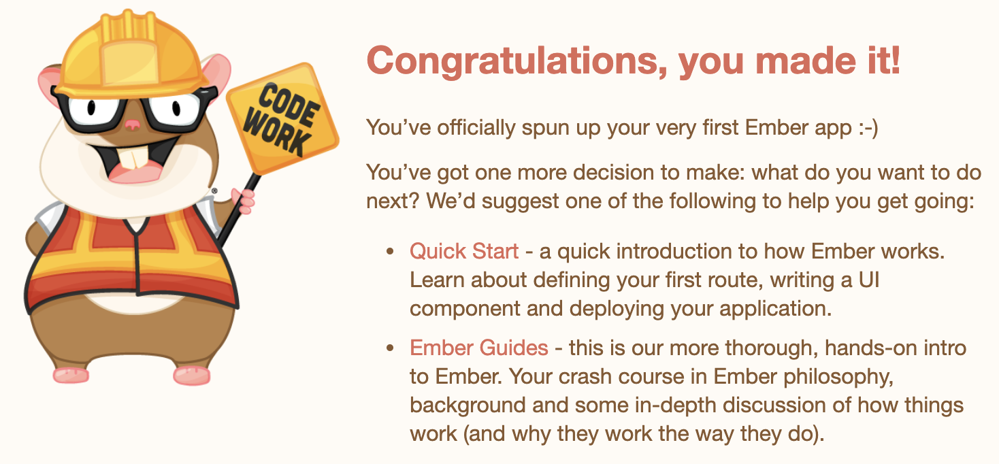
Well this was a nice welcome but not quite what we expected! To remove this welcome page, follow the instructions to remove the `{{welcome-page}}` component from your `templates/application.hbs` file.

## Load in our data
To load in our data from the API, there are several things we need to do:
1. Set up the API URL in `adapter/application.js`
2. Create a model for our event data
3. Fetch our data in our route javascript file
4. Display the data in the browser

### 1 - Set up the API URL in `adapter/application.js`
Create our adapter with Ember CLI:

`ember g adapter application`

This will create the file `app/adapters/application.js`, open it now and update it:

```javascript
import DS from 'ember-data';
import { computed } from '@ember/object';

export default DS.RESTAdapter.extend({
  host: computed(function(){
    return 'http://localhost:8000';
  }),
  namespace: 'api',
  buildURL: function(type, id, record) {
    //call the default buildURL and then append a slash
  return this._super(type, id, record) + '/';
  }
});
```

This is designating your Django URL with the API namespace as your API url: `http://localhost:8000/api`

The buildURL field is to munge the URL with a trailing slash, so when we hit our events api it is `http://localhost:8000/api/events/` ~ that trailing slash after `events` can be the source of a lot of frustration!

### 2 - Create a model for events
To load our data from our API call to our template we can create an ember model via the CLI:

`ember g model event`

We then go into `create app/models/event.js` and create our model with the same fields as we did in django:

```javascript
import DS from 'ember-data';
import { computed } from '@ember/object'
import moment from 'moment';
const { Model } = DS;

export default Model.extend({
    title: DS.attr(),
    presenter: DS.attr(),
    time: DS.attr(),
    location: DS.attr(),
    description: DS.attr(),
    formattedTime: computed('time', function() {
        return moment(this.time).format("ddd @ h:mm a, MMMM D, YYYY")
    })
});
```

Notice the `formattedTime` property? This is to change the time value that comes across the serializer in standard `2019-04-25T02:25:59Z` format into human readable datetime of `Tuesday @ 8:25 am, April 25, 2019`

### 3 - Get data in route js
Create a route for us to load in our data:

`ember g route events`

Navigate into the file `app/routes/events.js` and we will load our data as an API call:

```javascript
import Route from '@ember/routing/route';
import { inject as service } from '@ember/service';

export default Route.extend({
    store: service(),

    model() {
        const store = this.get('store');
        return store.findAll('event');
    }
});
```

Here we inject the (data) store as a service and use the `findAll` method to query our model via our API.

## before moving on to 4.. CORS
Let's spin up our application and see if we are able to hit our database. 

**spin up django**: `python manage.py runserver`

You should be able to direct your browser to `localhost:8000/api/events` and see that we have data the frontend should be able to hit an API to receive

**spin up ember**: `ember serve`

Open your browser and navigate to `localhost:4200/events`. You'll probaby see the browser is ember. If you open your dev console (right click in the browser and go to `inspect`, then click on the tab name `console`) you'll see the following error:
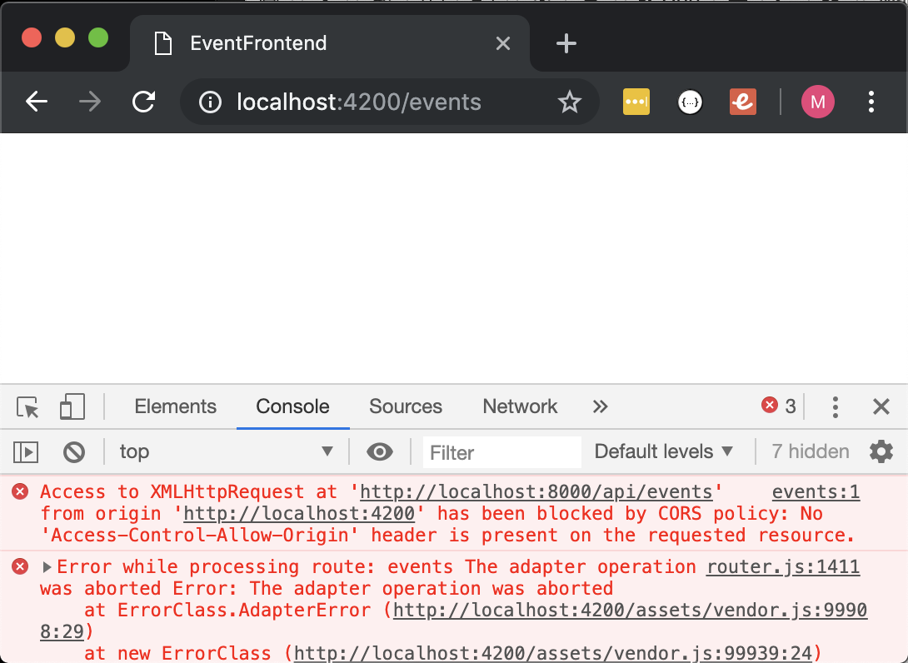

What is this giberish? It's a built in browser feature that says "the URL (origin) that made this API request is not allowed (via a CORS header) from the API response" and the browser does not allow the data to be transfered. To learn more about Cross Origin Resource Sharing, check out this [CORS Article](https://developer.mozilla.org/en-US/docs/Web/HTTP/CORS), however for now we're just going to open up our API to allow our frontend to hit it.

## Install Django-CORS-Headers
A Django App that adds CORS (Cross-Origin Resource Sharing) headers to responses. Just what we need! Install with pip into your django project:

`pip install django-cors-headers`

Add it to your installed_apps in `settings.py`

```python
INSTALLED_APPS = [
  'django.contrib.admin',
  'django.contrib.auth',
  'django.contrib.contenttypes',
  'django.contrib.sessions',
  'django.contrib.messages',
  'django.contrib.staticfiles',
  'rest_framework',
  'events',
  # corsheaders allows for cross origin communication
  'corsheaders',
]
```

Add it to the top of your middleware:

```python
MIDDLEWARE = [
  # put CorsMiddleware at the top of middleware
  'corsheaders.middleware.CorsMiddleware',
  'django.middleware.security.SecurityMiddleware',
  'django.contrib.sessions.middleware.SessionMiddleware',
```

And lastly, set the mode to debug so no origin shall be denied (**note**: you would not want to put this app on the web this way, but for local development this is fine)

```python
# opens access localhost:8000, including from frontend localhost:4200
CORS_ORIGIN_ALLOW_ALL = DEBUG
```

You may need to stop and start your backend server again, but with a referesh of the frontend, this error should go away. Now how to get the data to display in the browser? We'll work on that next!

### 4 - (**finally**) Displaying the Events in the Browser
Ember uses double curlies `{{ model }}` to pass in data to our handebar templates, so lets navigate into `app/templates/events.hbs` and place this below the header:

```html
<div class="container">
    <div class="display-1">Events Route</div>
    <div>{{ model }}</div>
</div>
```

And we get:
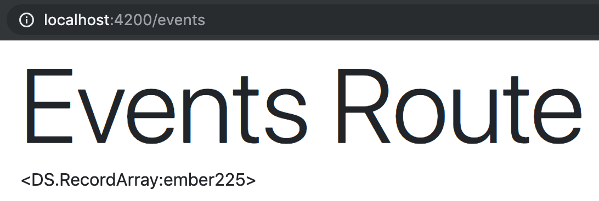

So the model is *in* our template, but not quite what we wanted. We know we have several model instances so lets use the ember `#each` helper to iterate through them:

```html
<div class="container">
    <div class="display-1">Events Route</div>
    {{#each model as |event|}}
      <div>{{ event }}</div>
    {{/each}}
</div>
```

This time we get:
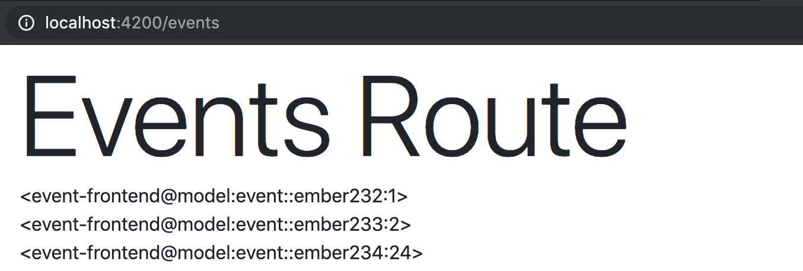

Progress! But now we need to access properties of the model:

```html
<div class="container">
    <div class="display-1">Events Route</div>
    {{#each model as |event|}}
      <div>{{ event.title }}</div>
    {{/each}}
</div>
```

Eureka!! Meaningful, human readable data:

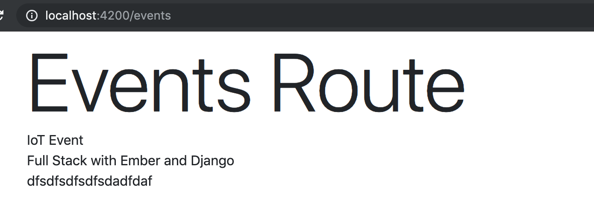

Let's load in the rest of our model fields and do some styling along with it:

```html
<div class="container">
  <h2 class="display-1">Upcoming Events</h2>
  {{#each model as |event|}}
  <div class="card mb-3">
    <div class="card-header p-3 lead">{{event.title}}</div>
    <ul class="list-group list-group-flush list-group-item-action">
      <li class="list-group-item p-1 pl-3">Who: {{event.presenter}} </li>
      <li class="list-group-item p-1 pl-3">What: {{event.description}}</li>
      <li class="list-group-item p-1 pl-3">Where: {{event.location}}</li>
      <li class="list-group-item p-1 pl-3">When: {{event.formattedTime}}</li>
    </ul>
  </div>
  {{/each}}
</div>
```

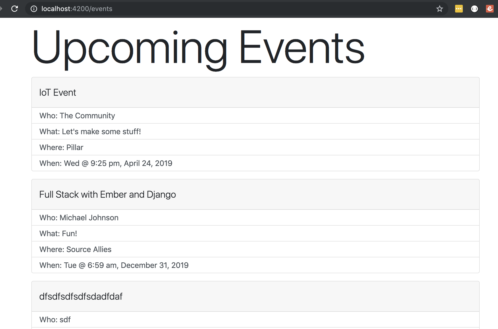

Beautiful! 

### 🙌 We have built R(etrieve) of CRUD for our REST API Frontend Client 

## Low Hanging Fruit: Delete
POSTing/C(reating) and PUTing/U(pdating) will require us to get user input via forms. This adds a level of complexity to our frontend application. For now, let's get delete working so we can demonstrate ember actions. 

**Note**: If you need to create more data in the meantime in your DB, you can always do that via your backend API at `localhost:8000/api/events`.

To do this we will:
1. Create an action in our `events.hbs` and pass the event back
2. Create a controller for events.js to handle our action
3. Call a `destroyRecord` method on the event to delete the instance

### 1 - Create an action in events.hbs
You can put an ember action on any element in your hbs. We will be using a div and instantiating the action with `{{action 'delete' event}}`. 
- `action` invokes an action that should be handled in the route or controller
- `'delete'` will be the name of our action in our controller
- `event` is a parameter that will be passed into our action

```html
...truncated...
    <div class="card-header p-3 lead">
      {{event.title}}
      <div class="btn btn-danger btn-lg float-right" role="button" {{action 'delete' event}}>Del
    </div>
    <ul class="list-group list-group-flush list-group-item-action">
...truncated...
```

You should see the button render in the browser. You can click on it, but you will get an error stating that the action is not handled. Let's handle that next

### 2/3 - Create a crontroller for events.js to handle our action
Using Ember CLI:

`ember g controller events`

Then navigate into the file `app/controllers/events.js`. We will create this action to handle our delete:

```javascript
import Controller from '@ember/controller';

export default Controller.extend({
  actions: {
    delete(event) {
      event.destroyRecord()
    },
  }
});
```

The event is passed into the action. The method `detroyRecord()` is called on it to delete the model instance. This persists back to the database with an API call to django.

### 🙌 🙌 Now we have R(etrieve) and D(elete) of CRUD for our REST API Frontend Client 

## Optional: Method 2 - does it work with our FrontEnd?
If you chose to do Method 2 on the API side, building up `http://localhost:8000/api_verbose` endpoints, then you can follow this path to the frontend. If you did not, you'll want to skip this section or go back and complete it before following this optional path.

Navigate back to file `app/adapters/application.js`, open it now and update it to use our `api_verbose` URL:

```javascript
import DS from 'ember-data';
import { computed } from '@ember/object'

export default DS.JSONAPIAdapter.extend({
    host: computed(function() {
        return 'http://localhost:8000';
    }),
    // namespace: 'api',
    namespace: 'api_verbose',
    buildURL: function(type, id, record) {
        //call the default buildURL and then append a slash
        return this._super(type, id, record) + '/';
    }
});
```

After you save you can reload your frontend and everything should function the same. That's because both DRF solutions we used work exactly the same way. You can verify we are using the new endpoint by:

1. Right click in the browser and open `Inspect`
2. Go to the network tab
3. Refresh the page
4. Click on the second `events` entry and you should see the URL is: http://localhost:8000/api_verbose/events/


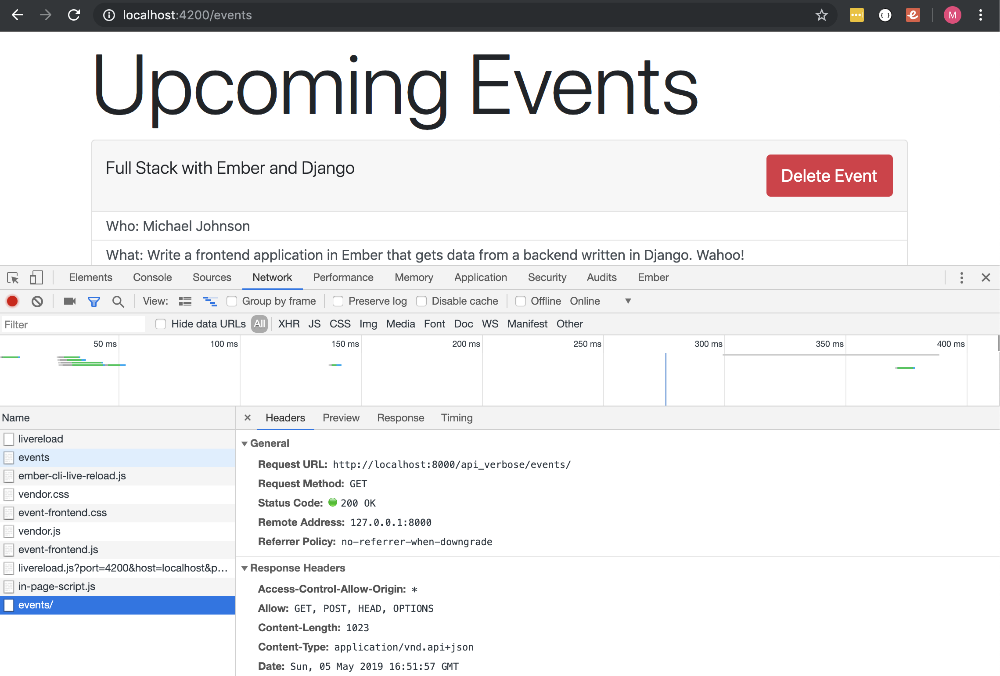

You can continue forward using the `api_verbose` namespace or go back to using `api`, they should both function the same for our porpoises 🐬

## Return to Main Path: Adding Create
Create and edit are not as straight forward to build Frontend interfaces. The approach we will take works, but it is by no means the only process that is possible. I also am choosing a path that will allow us to experience [`ember actions`](https://guides.emberjs.com/release/templates/actions/) and [`reusable components`](https://guides.emberjs.com/release/components/defining-a-component/). How exciting!

First, create our component via the CLI command:

`ember g component event-form`

Start by placing some boilerplate bootstrap form code in the component handlebars template located at `app/templates/components/event-form.hbs`:

```javascript
<div class="container mt-3">
  <h2>{{ title }}</h2>
   <div class="form-horizontal form-group form-group-lg row">
     <div class="col-md-5">
       {{input value='' class="form-control m-2" placeholder="Title of Event" autofocus="off"}}
       {{input value='' class="form-control m-2" placeholder="Who is Presenting" autofocus="off"}}
       {{input value='' class="form-control m-2" type="datetime-local" id="example-datetime-local-input"}}
       {{input value='' class="form-control m-2" placeholder="Location of Event" autofocus="off"}}
       {{textarea value='' class="form-control m-2" placeholder="Description" autofocus="off"}}
     </div>
   </div>
   <div class="m-2">
     <a class="btn btn-success btn-lg" href="#" role="button" {{action 'eventSave'}}>Save</a>
     <a class="btn btn-danger btn-lg" href="#" role="button" {{action 'eventCancel'}}>Cancel</a>
   </div>
</div>
```

Most of this should look fairly familiar if you've worked with forms. The classes are mostly for styling. THe input values are set to a blank string - we'll hook that up to our component javascript file here in a bit.

The two actions we have in our HBS are not currently functional. If you click on them you will get a console error stating they are unhandled actions. We'll also come back for that shortly.

### Putting Component into Event Route
Navigate to our event route and let's instantiate our component:

```html
<div class="container">
    <div class="card mb-3 mt-3 pb-3 card-header">
      <h2 class="display-3">Create New Event</h2>
      {{event-form title="Create New Event"}}
    </div>
</div>

<div class="container">
  <h2 class="display-1">Upcoming Events</h2>
  {{#each model as |event|}}
  <div class="card mb-3">
    <div class="card-header p-3 lead">
      {{event.title}}
      <div class="btn btn-danger btn-lg float-right" role="button" {{action 'delete' event}}>Delete Event</div>
    </div>
    <ul class="list-group list-group-flush list-group-item-action">
      <li class="list-group-item p-1 pl-3">Who: {{event.presenter}} </li>
      <li class="list-group-item p-1 pl-3">What: {{event.description}}</li>
      <li class="list-group-item p-1 pl-3">Where: {{event.location}}</li>
      <li class="list-group-item p-1 pl-3">When: {{event.formattedTime}}</li>
    </ul>
  </div>
  {{/each}}
</div>
```

This initial implementation shows how we "pass down" data via parameters in the component. Here we passed down the string `Create New Event` as the `title`. The reason we did this is so that when we reuse this component for updating our event, we will be able to pass down a different title, like `Edit Event`.

### Toggle Action to Show/Hide Form
Now, this isn't necessary, but I don't like having the form hanging out there all the time. Let's go ahead and hide it with a computed property and place a button to toggle that property and unhide the form. First, let's create our property and action in `app/controller/events.js`:

```javascript
import Controller from '@ember/controller';
import { computed } from '@ember/object';

export default Controller.extend({
    createFormVisible: computed(() => false),
    
    actions: {
        toggleCreateForm: function() {
          this.toggleProperty('showCreateForm')
          console.log(this.showCreateForm)
        },

        delete(event) {
          event.destroyRecord()
        },
    }
});
```

Here we are setting the initial `createFormVisible` state to false. Then we are allowing `toggleCreateForm` to toggle the property for `createFormVisible` (if it is `true`>--toggles-->`false`, if it is `false`>--toggles-->`true`).

Next, we whave to put this functionality into action back in `events.hbs`:

```html
<div class="container">
  <button class="mt-3 btn btn-primary" {{ action "toggleCreateForm"}}>
    Create New Event
  </button>
  {{#if showCreateForm}}
    <div class="card mb-3 mt-3 pb-3 card-header">
      {{event-form title="Create New Event"}}
    </div>
  {{/if}}
</div>

<div class="container">
  <h2 class="display-1">Upcoming Events</h2>
  {{#each model as |event|}}
  <div class="card mb-3">
    <div class="card-header p-3 lead">
      {{event.title}}
      <div class="btn btn-danger btn-lg float-right" role="button" {{action 'delete' event}}>Delete Event</div>
    </div>
    <ul class="list-group list-group-flush list-group-item-action">
      <li class="list-group-item p-1 pl-3">Who: {{event.presenter}} </li>
      <li class="list-group-item p-1 pl-3">What: {{event.description}}</li>
      <li class="list-group-item p-1 pl-3">Where: {{event.location}}</li>
      <li class="list-group-item p-1 pl-3">When: {{event.formattedTime}}</li>
    </ul>
  </div>
  {{/each}}
</div>
```

Now you can run the frontend and check out the toggle action in it's full glory. Great, now let's move on to actually using this form to POST. Before we edit the component, we'll have to scaffold some functionality in the events route first.

### Create record and Save Actions
The idea of this component is that we will pass in an event, that event then gets updated in the component, then the event gets saved in the component. We will also send an action back up from the component into the route in order to close the form and create a new blank event. Hopefully this will all make sense as we go along 💩

In `events.hbs` we will need to update our event-form component and pass in a few more parameters:

```html
<div class="container">
  <button class="mt-3 btn btn-primary" {{ action "toggleCreateForm"}}>
    Create New Event
  </button>
  {{#if showCreateForm}}
    <div class="card mb-3 mt-3 pb-3 card-header">
      {{event-form title="Create New Event" event=newEvent save=(action 'createSave') cancel=(action 'createCancel')}}
    </div>
  {{/if}}
</div>

<div class="container">
  <h2 class="display-1">Upcoming Events</h2>
  {{#each model as |event|}}
    {{#if event.id}}
      <div class="card mb-3">
        <div class="card-header p-3 lead">
          {{event.title}}
          <div class="btn btn-danger btn-lg float-right" role="button" {{action 'delete' event}}>Delete Event</div>
        </div>
        <ul class="list-group list-group-flush list-group-item-action">
          <li class="list-group-item p-1 pl-3">Who: {{event.presenter}} </li>
          <li class="list-group-item p-1 pl-3">What: {{event.description}}</li>
          <li class="list-group-item p-1 pl-3">Where: {{event.location}}</li>
          <li class="list-group-item p-1 pl-3">When: {{event.formattedTime}}</li>
        </ul>
      </div>
    {{/if}}
  {{/each}}
</div>
```

First `event=newEvent` is passing in the new event model that' we'll create shortly in our javascript file. Then `save=(action 'createSave')` says that when the component calls `this.save()`, go ahead and run the action `createSave()` at this route/controller context. Same for `cancel=(action 'createCancel')`.

Let's see what all of this looks like (creating `newEvent`, `createCancel` and `createSave`) in our `app/controller/events.js`:

```javascript
import Controller from '@ember/controller';
import { computed } from '@ember/object';
import { inject as service } from '@ember/service';

export default Controller.extend({
    store: service(),
    showCreateForm: false,
    newEvent: computed(function() {
      return this.store.createRecord('event');
    }),
    
    actions: {
        toggleCreateForm() {
          this.toggleProperty('showCreateForm');
        },
        
        createSave() {
          this.notifyPropertyChange('newEvent');
          this.set('showCreateForm', false);
        },

        createCancel() {
          this.set('showCreateForm', false);
        },

        delete(event) {
          event.destroyRecord()
        },
    }
});
```

The property `newEvent` is wrapped in a computed function to access `this` as well as allow us to recreate the `newEvent` upon saving.

When we save, we notify `newEvent` that it has changed so computed runs again and creates us a new record in the data store. In both cases when we save or cancel, we close the form by setting the `showCreateForm` property to false.

This should be enough for the `events` route, let's implement the functionality we need in the event form component.

## Posting with Create Event Form
First, we need to create an object in our component's javascript file to handle the data for the form. Update `app/components/event-form.js` with:

```javascript
import moment from 'moment';
import { inject as service } from '@ember/service';

export default Component.extend({
  store: service(),
  form: computed(function() {
    const time = moment(this.event.time).format('YYYY-MM-DDTHH:mm:ss')
    return {
      title: this.event.title,
      presenter: this.event.presenter,
      time: time,
      location: this.event.location,
      description: this.event.description,
    }
  }),
});
```

For the most part this should be straight forward, except the time portion. Did I mention previously that time is difficult? 😂Many hours have been spent at my previous place of work lamenting and fixing time conversion issues. This little munge is just to convert the time from the API into a time that the Bootstrap form can read so that we can update. We will have to convert it back in our `eventSave()` action once we get there.

Time aside, we are taking the event that is passed in (`this.event`) and setting all of the form properties equal to it. In this use case, the event passed in is a fresh event, so we do not expect there to be anything in the form when we open it.

Let's update our `app/templates/components/event-form.hbs` to bind to this form object to the form in our hbs through the `value` property in the form inputs:

```html
<div class="container mt-3">
  <h2 class="display-3">{{ title }}</h2>
   <div class="form-horizontal form-group form-group-lg row">
     <div class="col-md-5">
       {{input value=form.title class="form-control m-2" placeholder="Title of Event" autofocus="off"}}
       {{input value=form.presenter class="form-control m-2" placeholder="Who is Presenting" autofocus="off"}}
       {{input value=form.time class="form-control m-2" type="datetime-local" id="example-datetime-local-input"}} 
       {{input value=form.location class="form-control m-2" placeholder="Location of Event" autofocus="off"}}
       {{textarea value=form.description class="form-control m-2" placeholder="Description" autofocus="off"}}
     </div>
   </div>
   <div class="m-2">
     <a class="btn btn-success btn-lg" href="#" role="button" {{action 'eventSave'}}>Save</a>
     <a class="btn btn-danger btn-lg" href="#" role="button" {{action 'eventCancel'}}>Cancel</a>
   </div>
</div>
```

Now we need to implement `eventSave` and `eventCancel` actions in our javascript file `event-form.js`:

```javascript
import Component from '@ember/component';
import { computed } from '@ember/object';
import moment from 'moment';
import { inject as service } from '@ember/service';

export default Component.extend({
  store: service(),
  form: computed(function() {
    const time = this.event.time ? moment(this.event.time).format('YYYY-MM-DDTHH:mm:ss') : ''
    return {
      title: this.event.title,
      presenter: this.event.presenter,
      time: time,
      location: this.event.location,
      description: this.event.description,
    }
  }),

  actions: {
    eventSave() {
        const now = moment().format('YYYY-MM-DDThh:mm:ssZ')
        const time = this.form.time ? `${this.form.time}-05:00` : now
        this.event.setProperties({
            'title': this.form.title,
            'presenter': this.form.presenter,
            'time': time,
            'location': this.form.location,
            'description': this.form.description,
        });
        this.event.save().then(() => {
            this.save();
            this.notifyPropertyChange('form');
        })
    },
    eventCancel() {
        this.cancel();
    }
  }
});

```

As mentioned earlier, to get time to play nicely with this form and what the API expects,we have to do a bit of time munging. Then we save the event, which makes an API call and persists the event to the database. Then we send our save action up to the parent controller so it can refresh the `newEvent` record, and notify the form that it's time has come to recaculate it's values, too.

Alright, this should be it! Because tracking the actions from the parent controller to the child component can be difficult, I created the following infographic to help detail this process.

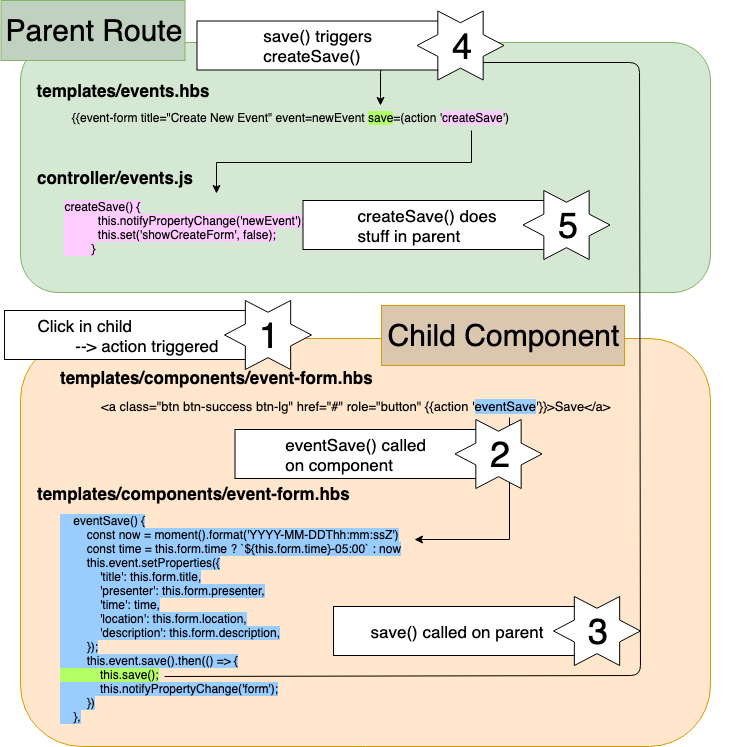

### 🙌 🙌 Now we have C(reate), R(etrieve) and D(elete) of CRUD - all that's left is update!

## Using form component to Updated (PUT) Events
We will reuse the form for creating an event, repurposed for editing an event we will need to:
1. Place a form in each 
